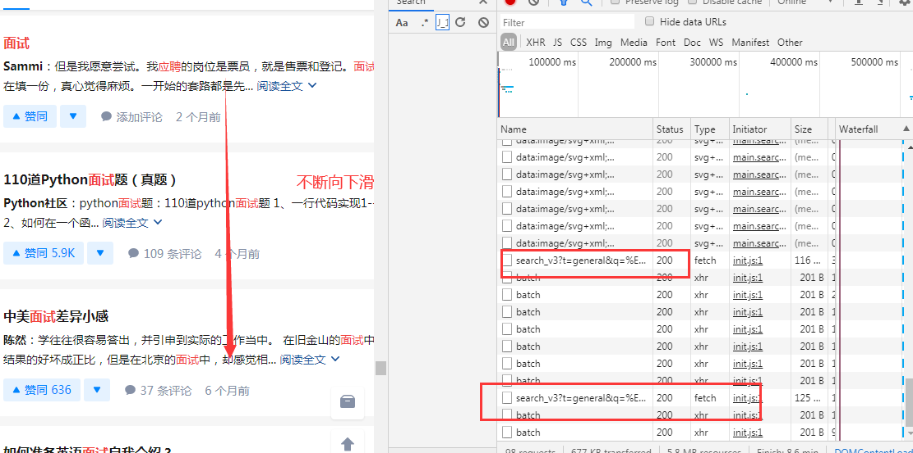
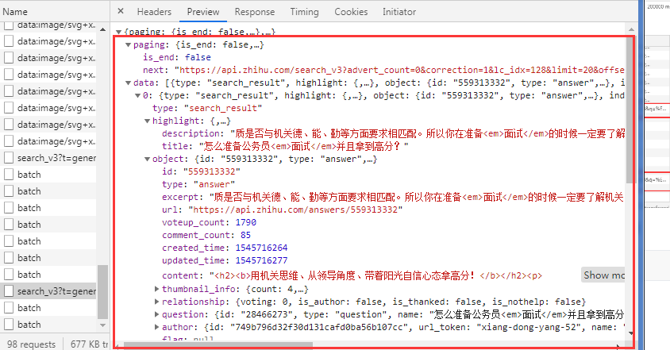
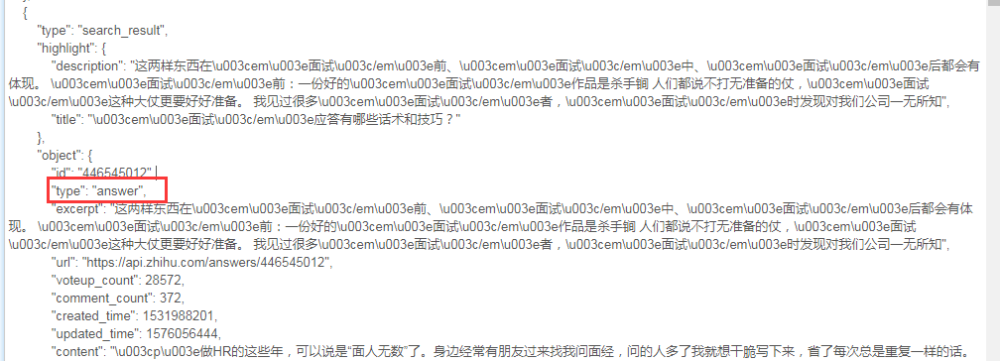
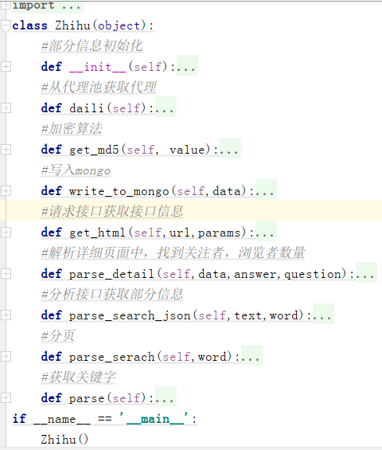
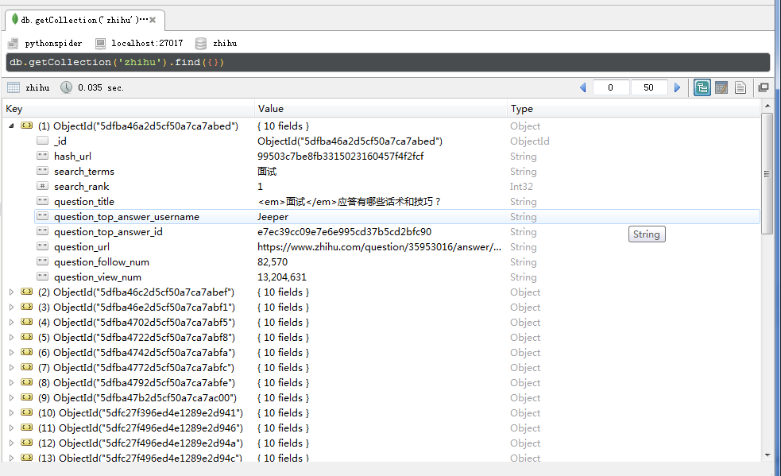

# Zhihu-spider

## 使用方法

（因为本代码需要将信息保存到mongo中，需保证mongo是开启的状态。）

首先在代理池的run方法，右键运行代理池，将代理池开启。

运行Zhihu-spider。

## 用到的库

- Python 3
- requests
-  lxml import etree
- hashlib

## 分析页面信息：

### 判断和寻找接口

1.首先在https://www.zhihu.com/页面中，页面是不断向下滑，页面内容不断加载，所以判断信息应该存储在接口中。

搜索面试，查看控制台



发现右边的这个地址每隔一段时间就会出现，打开查看，发现信息就在里面，通过这个接口就可以获取一些信息



这个接口的地址是：[https://www.zhihu.com/api/v4/search_v3?t=general&q=%E9%9D%A2%E8%AF%95&correction=1&offset=120&limit=20&lc_idx=128&show_all_topics=0&search_hash_id=34ca0deb5b57217f40bb51fe1e71b8d8&vertical_info=1%2C1%2C0%2C0%2C0%2C0%2C0%2C0%2C0%2C1](https://www.zhihu.com/api/v4/search_v3?t=general&q=面试&correction=1&offset=120&limit=20&lc_idx=128&show_all_topics=0&search_hash_id=34ca0deb5b57217f40bb51fe1e71b8d8&vertical_info=1%2C1%2C0%2C0%2C0%2C0%2C0%2C0%2C0%2C1)，经过不断的测试，发现和改变内容有关的参数，

```
params = {
    'q': '{}'.format(word),#这里是搜索的内容
    'offset': str(i),#每页的内容，最大可达到180
    'limit' : '20',#每次增加20
}
```


分析接口中的信息


将信息复制下来，放到js格式化工具中。




分析出来，信息就在里面，取出来就可以了。

### 详细页面

2.点击标题进入下一个页面发现这个页面的地址是这样组成的，所以在接口信息中的

取出question里的id和object里面的id拼接而成


这个页面的信息可以直接通过requests.get获取，获取信息。

以上是分析页面获取信息的过程。


## 代码解释：




### 保存到mongo中：

```
#加密算法
def get_md5(self, value):
    md5 = hashlib.md5()
    md5.update(value.encode('utf-8'))
    return md5.hexdigest()
#写入mongo，设置了一个增量爬虫，保证每次爬取进来的信息是不重复且增加的
def write_to_mongo(self,data):
    hash_url = self.get_md5(data['question_url'])
    data['hash_url'] = hash_url
    self.db['zhihu'].update({'hash_url': data['hash_url']}, {'$set': data}, True)
    print(data)
```

### 代理池：


### 代理池的思路：

1.db组件：操作redis连接；  从头部获取一定数量的代理，是为了校验；  提供一个从尾部获取代理的方法，将可用的代理添加到尾部； 提供代理池数量的方法

2.getter组件：爬取代理，从网上获取免费代理，为了做到可以循环调用所有的爬取网站的方法，我们定义了一个元类，元类的主要作用就是将两个变量设置到类变量中：__CrawlFunc__;__CrwalCount__。

3.scheduler组件（核心）：ValidityTester--校验代理类，校验的同时，添加到代理池。

PoolAdder--从网站获取，先校验（因为校验的同时在添加，所以直接从网站获取代理，校验就ok了。）还要做一个逻辑判断，给代理池设置一个最大和最小的阈值，如果小于最小值，说明代理不够了。我们就添加，如果代理大于最大值，那就说明代理多了，就停止。

4.api：提供接口，给外部调用  提供api外部接口，调用api然后就会获取一个代理

## 运行效果：

